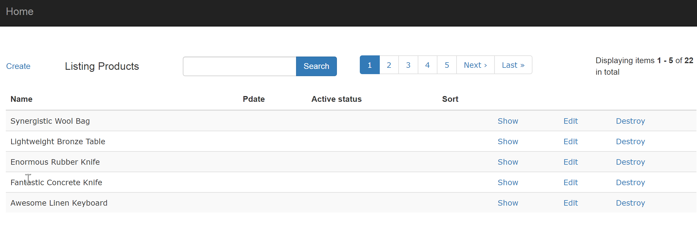
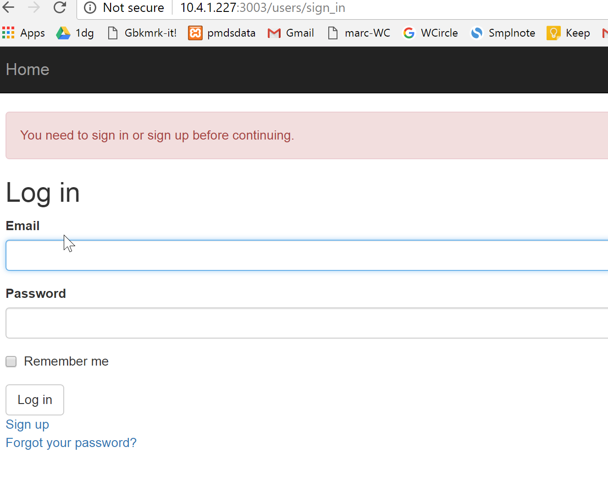
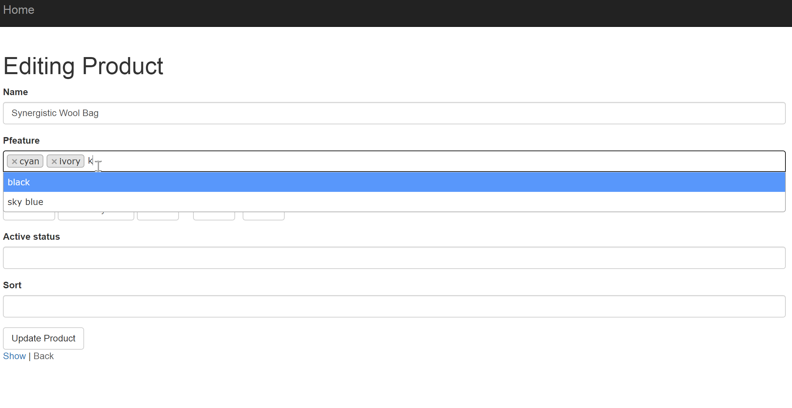
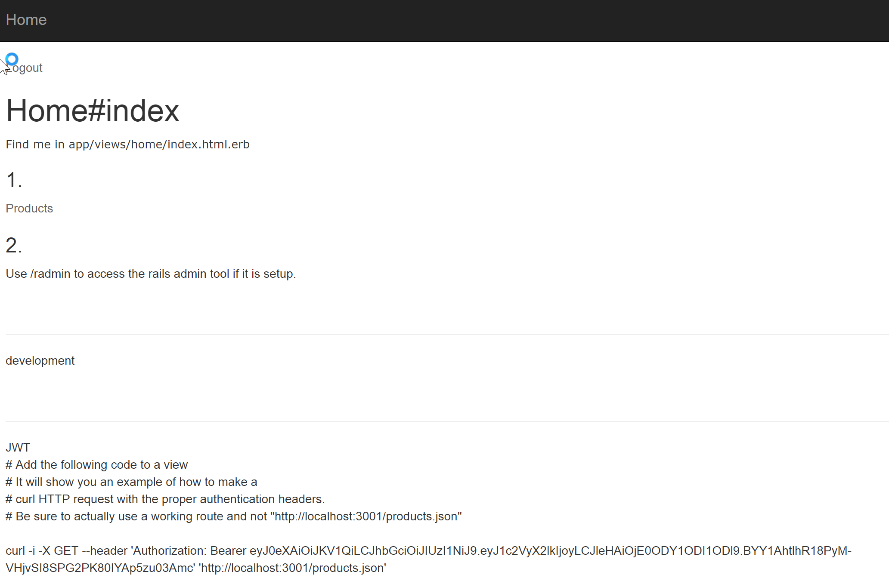

# bashrail

https://github.com/dgleba/bashrail

===

This is a set of bash and ruby scripts to create a rails app with features like

- bootstrap styling,
- select2 dropdown selects,
- devise login,
- cancancan role based access,
- kaminari pagination,
- ransack search,
- jwt token authentication
- database is populated with users, roles, and faked data,
- etc...

The resulting generated application has both an html interface which you can consume with most modern browsers and mobile device browsers, and a restful api which responds to json requests.

usage:

      bashrail/1mk.sh  project_name

where project_name is the name you want to give your new rails app..

example..

- input.. /var/web/bashrail
- output.. /var/web/project_name
- run command above from /var/web

--

edit 1mk.sh

- There are some Mac OSX specific settings around line 77. Check that.
- Check to see if you might just run it the way it is and give it a go.
- when it is up and running, then maybe...
- edit scaffolds.
- try it out.
- change the files to your liking, turn things on or off, then run it again with a new \$appn / project_name on the commandline if you like.

--

To run the resulting app...

- cd project_name
- rails s -b 0.0.0.0
- visit localhost:3000/ or ipaddress:3000/
- login as:

  - admin: username = a password = a
  - regular: username = r password = a

- to use the api, see bashrail/docsbr/ for tips on how to consume the restful json api

===

# Images:

---

    

---

---

    Check out more images in  `docs/images`  folder...

===

### Notes..

# History

- See README-history-summary.md

ref..
Rail308

===

# GPL License

Copyright (c) 2017, David Gleba

This project is free software; you can redistribute it and/or modify it under the terms of the GNU General Public License (GPL) as published by the Free Software Foundation; either version 2 of the License, or (at your option) any later version.

This program is distributed in the hope that it will be useful, but WITHOUT ANY WARRANTY; without even the implied warranty of MERCHANTABILITY or FITNESS FOR A PARTICULAR PURPOSE. See the GNU General Public License for more details.

To read the license please visit http://www.gnu.org/copyleft/gpl.html
